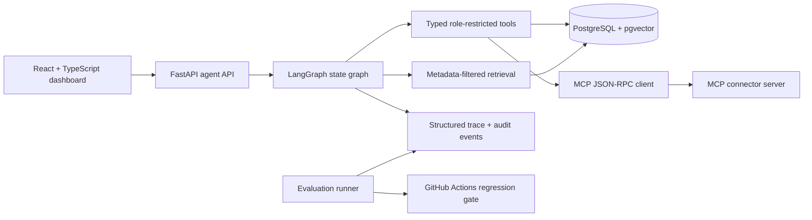

# Architecture

AgentOps is a portfolio implementation of an enterprise-oriented AI operations control plane. The React dashboard is hosted by the managed Node application, while the Python reference services expose the FastAPI agent boundary, MCP JSON-RPC server, retrieval contracts, evaluation runner, and PostgreSQL/pgvector schema.

The runtime intentionally separates UI scaffolding from provider-backed execution. Database URLs, OpenAI credentials, MCP endpoints, API keys, and role mappings are environment-managed. The repository does not claim customer traffic or a production deployment.
